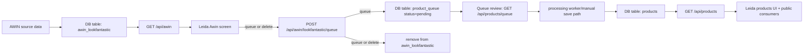

# Leida Products

This repository contains the Leida founder/admin workflows for affiliate products, plus the runtime app shell that renders public-facing experiences.

The most important pipeline in this codebase is:

1. Ingest raw AWIN Lookfantastic Product Feed
2. Decide queue vs delete in admin UI
3. Stage selected items in product_queue
4. Process into cleaned products rows (AI-enhanced path)
5. Consume products in Leida/public UI

## End-to-end data flow

## What each layer does

## 1) AWIN source table and search API

Raw affiliate rows are queried from a Postgres table (default `awin_lookfantastic`) by:

- [app/api/awin/get.ts](app/api/awin/get.ts)
- [app/api/awin/route.ts](app/api/awin/route.ts)

Supported behavior includes:

- text/category/brand filtering
- pagination via `limit` + `offset`
- sorting by `created_at`, `id`, `product_name`, `category_name`, `search_price`, and brand pseudo-sort

The Leida admin screen that consumes this endpoint is:

- [app/Leida/components/Awin/Awin.tsx](app/Leida/components/Awin/Awin.tsx)

This screen uses:

- [app/Leida/components/Awin/actions/fetchAwin.tsx](app/Leida/components/Awin/actions/fetchAwin.tsx)
- [app/Leida/components/Awin/components/AwinList.tsx](app/Leida/components/Awin/components/AwinList.tsx)
- [app/Leida/components/Awin/components/AwinDetail.tsx](app/Leida/components/Awin/components/AwinDetail.tsx)

Important UI behavior:

- DataGrid server pagination/sort/search
- title-first list defaults
- row selection + bulk actions
- detail dialog for per-product actions

## 2) Queue/delete decision from AWIN

When a founder selects products in Awin, decisions are posted to:

- [app/api/awin/lookfantastic/queue/route.ts](app/api/awin/lookfantastic/queue/route.ts)

The route supports:

- single product payload (`awinProduct`)
- filtered selection payload (`awinQuery` + `selection`)
- decisions: `queue` or `delete`

Behavior:

- `queue`: insert a pending row into `product_queue` (dedupe protected), then remove source row(s) from `awin_lookfantastic`
- `delete`: remove source row(s) from `awin_lookfantastic` without queue insert

Related bulk route:

- [app/api/awin/lookfantastic/queue/bulk/route.ts](app/api/awin/lookfantastic/queue/bulk/route.ts)

Client-side delete/queue calls are wired through:

- [app/Leida/components/Awin/actions/processAwin.tsx](app/Leida/components/Awin/actions/processAwin.tsx)
- [app/Leida/components/Awin/components/AwinProcess.tsx](app/Leida/components/Awin/components/AwinProcess.tsx)
- [app/Leida/components/Awin/components/AwinDetail.tsx](app/Leida/components/Awin/components/AwinDetail.tsx)

## 3) Queue table

Queue storage schema is documented in:

- [app/api/awin/sql/product_queue.sql](app/api/awin/sql/product_queue.sql)

Read API:

- [app/api/products/queue/get.ts](app/api/products/queue/get.ts)
- [app/api/products/queue/route.ts](app/api/products/queue/route.ts)

Leida queue UI:

- [app/Leida/components/Awin/components/Queue.tsx](app/Leida/components/Awin/components/Queue.tsx)

This table is intended to hold pending decisions and processing status transitions (`pending`, `done`, `failed`).

## 4) Products table (cleaned/AI-ready objects)

The long-lived products used across Leida are in `public.products`.

Read and delete APIs:

- [app/api/products/get.ts](app/api/products/get.ts)
- [app/api/products/delete.ts](app/api/products/delete.ts)
- [app/api/products/route.ts](app/api/products/route.ts)
- [app/api/products/[product_id]/route.ts](app/api/products/[product_id]/route.ts)

Current explicit save path from AWIN payload to products:

- [app/api/awin/lookfantastic/save/route.ts](app/api/awin/lookfantastic/save/route.ts)

That route normalizes and inserts into `products`, including source metadata under `data`.

## 5) Products admin UI (processed products)

Processed products are now rendered with a DataGrid pattern matching AwinList in:

- [app/Leida/components/Products/components/ListProducts.tsx](app/Leida/components/Products/components/ListProducts.tsx)

Behavior:

- server-side paging/sorting/search via `/api/products`
- checkbox selection
- default visible columns: title + checkbox only
- bulk delete with confirmation (`ConfirmAction`)

Note: [app/Leida/components/Products/Products.tsx](app/Leida/components/Products/Products.tsx) currently renders a lightweight placeholder panel; the table view is exposed on the list route.

## 6) Public-facing consumption

The app shell entrypoint is:

- [app/[[...slug]]/page.tsx](app/[[...slug]]/page.tsx)

Routing for Leida sections is handled by:

- [app/Leida/PageRouter.tsx](app/Leida/PageRouter.tsx)

A direct example of products consumption in UI is:

- [app/Leida/components/AffiliatePlayer/AffiliatePlayer.tsx](app/Leida/components/AffiliatePlayer/AffiliatePlayer.tsx)

`AffiliatePlayer` pulls from `/api/products` (via Leida bus/slice) and renders a product carousel experience. This is the practical bridge from processed product records to user-facing presentation.

## Leida state and fetch model

Leida uses Redux/Uberedux + thunk-style actions.

Common patterns:

- route-fetch bus cache: `fetchLeida('/api/...')`
- slice selectors: `useAwin()`, `useProducts()`, `useQueue()`, `useLeidaBus(route)`
- mutable UX state in component-local hooks (search term, selection models, dialogs)

Relevant actions/hooks include:

- [app/Leida/actions/fetchLeida.tsx](app/Leida/actions/fetchLeida.tsx)
- [app/Leida/components/Awin/hooks/useAwin.tsx](app/Leida/components/Awin/hooks/useAwin.tsx)
- [app/Leida/components/Products/hooks/useProducts.tsx](app/Leida/components/Products/hooks/useProducts.tsx)
- [app/Leida/components/Products/hooks/useQueue.tsx](app/Leida/components/Products/hooks/useQueue.tsx)

## Environment and tables

Core environment variables used in this flow:

- `DATABASE_URL` or `POSTGRES_URL` or `SUPABASE_DB_URL`
- `NEXT_PUBLIC_SUPABASE_URL`
- `SUPABASE_SERVICE_ROLE_KEY`
- `AWIN_LOOKFANTASTIC_TABLE` (default `awin_lookfantastic`)
- `AWIN_PRODUCT_QUEUE_TABLE` (default `product_queue`)
- `NEXT_PUBLIC_TENANT` (optional response envelope context)

## Operational notes

- If you see `ERR_EMPTY_RESPONSE` for local `/api/...` URLs in browser logs, this is usually a local server/runtime issue (dev server crash, env mismatch, or networking), not a client-side routing issue.
- AWIN UI actions intentionally remove source rows after queue/delete decisions to keep the source list actionable and reduce repeated triage.
- Queue insertion has unique-index protection for duplicate pending decisions.

## Known current gaps

- There is no clearly visible in-repo worker that turns `product_queue` pending rows into `products` and marks queue rows done/failed. The contract is implied by queue schema/status and the save route.
- [app/Leida/components/Products/Products.tsx](app/Leida/components/Products/Products.tsx) is currently a high-level placeholder view rather than embedding the table directly.

## Quick mental model

- Awin screen = triage raw affiliate feed data
- Queue table = staging and decision tracking
- Products table = curated, cleaned objects for real app use
- AffiliatePlayer/public surfaces = read from products table output
